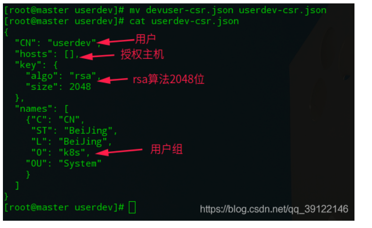

### 1.创建用户和密码

```shell
adduser devuser 
passwd devuser
```


### 2.创建证书：

```shell
[root@master ~]# mkdir rbac
[root@master ~]# cd rbac/
[root@master rbac]# mkdir cert
[root@master rbac]# cd cert/
[root@master cert]# ls
[root@master cert]# mkdir devuser
[root@master cert]# cd devuser/
[root@master devuser]# ls
[root@master devuser]# vim devuser-csr.json
{
    "CN": "devuser",
    "hosts": [],
    "key": {
        "algo": "rsa",
        "size": 2048
    },
    "names": [
        {
            "C": "CN",
            "L": "Beijing",
            "ST": "Beijing",
            "O": "k8s",
            "OU": "System"
        }
    ]
}

[root@master devuser]# cat devuser-csr.json 
{
    "CN": "devuser",
    "hosts": [],
    "key": {
        "algo": "rsa",
        "size": 2048
    },
    "names": [
        {
            "C": "CN",
            "L": "Beijing",
            "ST": "Beijing",
            "O": "k8s",
            "OU": "System"
        }
    ]
}
```


解释：


### 3.下载证书生成工具


```shell
wget https://pkg.cfssl.org/R1.2/cfssl_linux-amd64
mv cfssl_linux-amd64 /usr/local/bin/cfssl
wget https://pkg.cfssl.org/R1.2/cfssljson_linux-amd64
mv cfssljson_linux-amd64 /usr/local/bin/cfssljson
wget https://pkg.cfssl.org/R1.2/cfssl-certinfo_linux-amd64
mv cfssl-certinfo_linux-amd64 /usr/local/bin/cfssl-certinfo
```


准备cfssl 工具

```shell
 [root@master bin]#cd /usr/local/bin/
[root@master bin]# rz -y

[root@master bin]# ls
cfssl  cfssl-certinfo  cfssljson
[root@master bin]# chmod a+x *


```


[root@master devuser]# cd /etc/kubernetes/pki/

发现这个目录下都是k8s系统保留的证书：

[root@master pki]# ls
apiserver.crt              apiserver-etcd-client.key  apiserver-kubelet-client.crt  ca.crt  etcd                front-proxy-ca.key      front-proxy-client.key  sa.pub
apiserver-etcd-client.crt  apiserver.key              apiserver-kubelet-client.key  ca.key  front-proxy-ca.crt  front-proxy-client.crt  sa.key
[root@master pki]# 


所有https证书的签发都是根据k8s集群的根证书`ca`进行签发

```shell
cfssl gencert -ca=ca.crt -ca-key=ca.key  -profile=kubernetes /root/rbac/cert/devuser/devuser-csr.json  | cfssljson -bare devuser

2021/01/10 21:25:03 [INFO] generate received request
2021/01/10 21:25:03 [INFO] received CSR
2021/01/10 21:25:03 [INFO] generating key: rsa-2048
2021/01/10 21:25:04 [INFO] encoded CSR
2021/01/10 21:25:04 [INFO] signed certificate with serial number 312464528147703423488942122381778053915203103509
2021/01/10 21:25:04 [WARNING] This certificate lacks a "hosts" field. This makes it unsuitable for
websites. For more information see the Baseline Requirements for the Issuance and Management
of Publicly-Trusted Certificates, v.1.1.6, from the CA/Browser Forum (https://cabforum.org);
specifically, section 10.2.3 ("Information Requirements").
```


[root@master pki]# ls -lrt
total 68
-rw-------. 1 root root 1675 Oct 31 21:09 ca.key
-rw-r--r--. 1 root root 1025 Oct 31 21:09 ca.crt
-rw-------. 1 root root 1675 Oct 31 21:09 apiserver.key
-rw-r--r--. 1 root root 1216 Oct 31 21:09 apiserver.crt
-rw-------. 1 root root 1675 Oct 31 21:09 apiserver-kubelet-client.key
-rw-r--r--. 1 root root 1099 Oct 31 21:09 apiserver-kubelet-client.crt
-rw-------. 1 root root 1675 Oct 31 21:09 front-proxy-ca.key
-rw-r--r--. 1 root root 1038 Oct 31 21:09 front-proxy-ca.crt
-rw-------. 1 root root 1679 Oct 31 21:09 front-proxy-client.key
-rw-r--r--. 1 root root 1058 Oct 31 21:09 front-proxy-client.crt
drwxr-xr-x. 2 root root  162 Oct 31 21:09 etcd
-rw-------. 1 root root 1675 Oct 31 21:09 apiserver-etcd-client.key
-rw-r--r--. 1 root root 1090 Oct 31 21:09 apiserver-etcd-client.crt
-rw-------. 1 root root  451 Oct 31 21:09 sa.pub
-rw-------. 1 root root 1679 Oct 31 21:09 sa.key
-rw-r--r--  1 root root 1237 Jan 10 21:25 devuser.pem
-rw-------  1 root root 1679 Jan 10 21:25 devuser-key.pem
-rw-r--r--  1 root root  997 Jan 10 21:25 devuser.csr


`devuser.csr`证书签名请求，要发给 CA 组织
`devuser.pem` ：证书
`devuser-key.pem`：私钥


### 4.设置集群参数


```shell
 cd /root/rbac/cert/devuser/

export KUBE_APISERVER="https://192.168.184.120:6443"

kubectl config set-cluster kubernetes --certificate-authority=/etc/kubernetes/pki/ca.crt --embed-certs=true --server=${KUBE_APISERVER} --kubeconfig=devuser.kubeconfig

[root@master devuser]# ls
devuser-csr.json  devuser.kubeconfig
[root@master devuser]# cat  devuser.kubeconfig
apiVersion: v1
clusters:
- cluster:
    certificate-authority-data: LS0tLS1CRUdJTiBDRVJUSUZJQ0FURS0tLS0tCk1JSUN5RENDQWJDZ0F3SUJBZ0lCQURBTkJna3Foa2lHOXcwQkFRc0ZBREFWTVJNd0VRWURWUVFERXdwcmRXSmwKY201bGRHVnpNQjRYRFRJd01UQXpNVEV6TURrd05Wb1hEVE13TVRBeU9URXpNRGt3TlZvd0ZURVRNQkVHQTFVRQpBeE1LYTNWaVpYSnVaWFJsY3pDQ0FTSXdEUVlKS29aSWh2Y05BUUVCQlFBRGdnRVBBRENDQVFvQ2dnRUJBTHM4CmFDOXFZQWVDbGIrcEVMNXYweXdSSVJwcVdpRFRBYW5tZlJtYVZ1QW5rSDllN3V4K1Y1YmhEK3hOaWtUSjNBY1QKK0wrQjhYRXVnY3ZnOWltdVV5aWd3UzRmOGRBclV6MUZMZkdVTW13Z2NtSFZsdUZlT05xS1BJVmJLamVid2p2ZQptb1BUWThiS2RwN3JndnlZM2ZSN1lSNDBxOVZtMUovdW9OdDYxSytKb3BpWEFJZlZvNy9CWXZOdERURGk4THMvClJZQTQxc3kvNU5LeHg5ZldCOEtxdTNPNGlaVGRIbUZBRnVZSGxzaFlQV2g3SDFFUkM4Qmw1Skx0V1V0cjJEM2wKK1lZNmU4SHp1ZWRlL3JtUStsTFF5aG1ZNmdDOTJ4dHI5b3dyWjNWQ2x6cGNtUE5SQ2l0OG5xU3dEVVJBUXNwaQowcElvZWU4eHVNRHFRbHhVaTlNQ0F3RUFBYU1qTUNFd0RnWURWUjBQQVFIL0JBUURBZ0trTUE4R0ExVWRFd0VCCi93UUZNQU1CQWY4d0RRWUpLb1pJaHZjTkFRRUxCUUFEZ2dFQkFCeWxLNE1rekVld3o0YmRaYi9paWJJL29RUEsKN1hxOVRUaFZYRHNLRVlheEptcnZ2TDhvNnI3NFc1U2IyeE96ZkYxbmxQMVFJUUxBWEdQTGpsbWpPR0oxRndXWgowNEhLUG11RFd0blA5azRkYXphTUNMSTBIWWNIcXdLR3dwbmFYUHhwQk9UeldMZHE5bzVjeW42UjVyZHlWckV3CkpPNmdjMXBGNjRlMHVGUkVCNG15cUtaWkk5bVZ3a01raU44WGQvTFpoU1BwZmZFa04xY3VzOWFCM3lJUlVSSmMKVVFJVW5za3RiS2dBM1NNM3AvYzM2RGoyckdyRnB4bEV1eThEaTN2dFdGMGxiejliLzY4eVFsWWtSbk9XbmxEOAp1ZTFYcUZVMGtlUVJqVXpaVVpuV3hDblJEWjl5dXdrelNNRHI0QWJ0U3dVTlMwa1dkLzlpS2poZzZ2dz0KLS0tLS1FTkQgQ0VSVElGSUNBVEUtLS0tLQo=
    server: https://192.168.184.120:6443
  name: kubernetes
contexts: null
current-context: ""
kind: Config
preferences: {}
users: null

```

此时可以看到已经有了集群信息`clusters`


### 5.设置客户端认证参数

```shell
kubectl config set-credentials devuser --client-certificate=/etc/kubernetes/pki/devuser.pem --client-key=/etc/kubernetes/pki/devuser-key.pem --embed-certs=true --kubeconfig=devuser.kubeconfig

[root@master devuser]# cat devuser.kubeconfig 
apiVersion: v1
clusters:
- cluster:
    certificate-authority-data: LS0tLS1CRUdJTiBDRVJUSUZJQ0FURS0tLS0tCk1JSUN5RENDQWJDZ0F3SUJBZ0lCQURBTkJna3Foa2lHOXcwQkFRc0ZBREFWTVJNd0VRWURWUVFERXdwcmRXSmwKY201bGRHVnpNQjRYRFRJd01UQXpNVEV6TURrd05Wb1hEVE13TVRBeU9URXpNRGt3TlZvd0ZURVRNQkVHQTFVRQpBeE1LYTNWaVpYSnVaWFJsY3pDQ0FTSXdEUVlKS29aSWh2Y05BUUVCQlFBRGdnRVBBRENDQVFvQ2dnRUJBTHM4CmFDOXFZQWVDbGIrcEVMNXYweXdSSVJwcVdpRFRBYW5tZlJtYVZ1QW5rSDllN3V4K1Y1YmhEK3hOaWtUSjNBY1QKK0wrQjhYRXVnY3ZnOWltdVV5aWd3UzRmOGRBclV6MUZMZkdVTW13Z2NtSFZsdUZlT05xS1BJVmJLamVid2p2ZQptb1BUWThiS2RwN3JndnlZM2ZSN1lSNDBxOVZtMUovdW9OdDYxSytKb3BpWEFJZlZvNy9CWXZOdERURGk4THMvClJZQTQxc3kvNU5LeHg5ZldCOEtxdTNPNGlaVGRIbUZBRnVZSGxzaFlQV2g3SDFFUkM4Qmw1Skx0V1V0cjJEM2wKK1lZNmU4SHp1ZWRlL3JtUStsTFF5aG1ZNmdDOTJ4dHI5b3dyWjNWQ2x6cGNtUE5SQ2l0OG5xU3dEVVJBUXNwaQowcElvZWU4eHVNRHFRbHhVaTlNQ0F3RUFBYU1qTUNFd0RnWURWUjBQQVFIL0JBUURBZ0trTUE4R0ExVWRFd0VCCi93UUZNQU1CQWY4d0RRWUpLb1pJaHZjTkFRRUxCUUFEZ2dFQkFCeWxLNE1rekVld3o0YmRaYi9paWJJL29RUEsKN1hxOVRUaFZYRHNLRVlheEptcnZ2TDhvNnI3NFc1U2IyeE96ZkYxbmxQMVFJUUxBWEdQTGpsbWpPR0oxRndXWgowNEhLUG11RFd0blA5azRkYXphTUNMSTBIWWNIcXdLR3dwbmFYUHhwQk9UeldMZHE5bzVjeW42UjVyZHlWckV3CkpPNmdjMXBGNjRlMHVGUkVCNG15cUtaWkk5bVZ3a01raU44WGQvTFpoU1BwZmZFa04xY3VzOWFCM3lJUlVSSmMKVVFJVW5za3RiS2dBM1NNM3AvYzM2RGoyckdyRnB4bEV1eThEaTN2dFdGMGxiejliLzY4eVFsWWtSbk9XbmxEOAp1ZTFYcUZVMGtlUVJqVXpaVVpuV3hDblJEWjl5dXdrelNNRHI0QWJ0U3dVTlMwa1dkLzlpS2poZzZ2dz0KLS0tLS1FTkQgQ0VSVElGSUNBVEUtLS0tLQo=
    server: https://192.168.184.120:6443
  name: kubernetes
contexts: null
current-context: ""
kind: Config
preferences: {}
users:
- name: devuser
  user:
    client-certificate-data: LS0tLS1CRUdJTiBDRVJUSUZJQ0FURS0tLS0tCk1JSURZekNDQWt1Z0F3SUJBZ0lVTnJ0azN5ekpDTjBYRXBRYjFZQ1F6SVhjYXhVd0RRWUpLb1pJaHZjTkFRRUwKQlFBd0ZURVRNQkVHQTFVRUF4TUthM1ZpWlhKdVpYUmxjekFlRncweU1UQXhNVEF4TXpJd01EQmFGdzB5TWpBeApNVEF4TXpJd01EQmFNR0l4Q3pBSkJnTlZCQVlUQWtOT01SQXdEZ1lEVlFRSUV3ZENaV2xxYVc1bk1SQXdEZ1lEClZRUUhFd2RDWldscWFXNW5NUXd3Q2dZRFZRUUtFd05yT0hNeER6QU5CZ05WQkFzVEJsTjVjM1JsYlRFUU1BNEcKQTFVRUF4TUhaR1YyZFhObGNqQ0NBU0l3RFFZSktvWklodmNOQVFFQkJRQURnZ0VQQURDQ0FRb0NnZ0VCQU1XagpHeHIrOWxKZHg5N1NzVWhMeG9CM290cjJ2MjdFSFRrb0VWRWQ5QTVTS0JEWFpRVDl1U3hoeHhINHppTnFNdnVZCmVDb0crYUVtN3hFTmh2bVFWS3VUUUdPdzhRMHFzZytlK1ptZXZZUFY1NjFIUkRZQURwd2k0MlpsekNlR3hIL1YKVzh5anVsRXNDS1FHbGFseUdsRkxBZ1NvRlpic1oybTRJdllTKzZqWXAvd3lsTExyQmNRZU5Wck9GR256aVJaKwozNnFqMWQxRnJVSEtIcDZHNW8zeUFtVTdHY0xSc0wzNEw4WGNCRFhOWUxXYUlob0Rwb0dmOTBsSnNsTG5INzZ5CjdpU2NsMzlaYnNzUEZRNzRWUTVqTW9qNFA2aTRnT05iVkFMTkFDTU9kaWVCazBjS2xWcmlBOW9qMmErNXJVc3UKOHV5c3gxTHE0SHo3Q2k5RldTc0NBd0VBQWFOZU1Gd3dEZ1lEVlIwUEFRSC9CQVFEQWdXZ01CMEdBMVVkSlFRVwpNQlFHQ0NzR0FRVUZCd01CQmdnckJnRUZCUWNEQWpBTUJnTlZIUk1CQWY4RUFqQUFNQjBHQTFVZERnUVdCQlJFCm1kNWtXMUIrV3ZNUk1DOHJ2UHhIWVFWR1dEQU5CZ2txaGtpRzl3MEJBUXNGQUFPQ0FRRUFxbDgwUFFSdW9Ea3YKV1ZkNkMvNjQ4ZlB6OWZWQW85a216WGdlbTZIVW1DSCtuS253RDQ2SVRZSGJOMTd6Ky9Tb3V1YjFDYXFDZCt4Ugoyc3cwL3VJcHdoaHBJVEJUWW5FbHl5R1ozeGRUZlEwVXZSUVk4ZXF0SjR5dWZaS2tBbUF0MkRpaUdyRmhJZGh5CjZlaVFLRGFNMUZuMmR6VXliYWt0TGxlblFqYUZKeHFhWHNrYlcrSkJBeDZjNTdBeC9kWVRWTUxUUk9kWUk2MlYKemRzZmEvMXV0cENvNXZJNVRIWjZUYlRJLzlacC84L1hjYU1DT1J5Z1pnVGRuN2FSQTdHaGJFeTRMMXFOUmFaYQorSTFSUksrOWhaZ2dTbWw4ZFhnTGtLSTlaZFdzSWptcExrOWhUUjE0eWJ4b0VqZWpsRGNEODZPTEtOcjFHQXd1CkF5NHdYRlRlWFE9PQotLS0tLUVORCBDRVJUSUZJQ0FURS0tLS0tCg==
    client-key-data: LS0tLS1CRUdJTiBSU0EgUFJJVkFURSBLRVktLS0tLQpNSUlFcFFJQkFBS0NBUUVBeGFNYkd2NzJVbDNIM3RLeFNFdkdnSGVpMnZhL2JzUWRPU2dSVVIzMERsSW9FTmRsCkJQMjVMR0hIRWZqT0kyb3krNWg0S2diNW9TYnZFUTJHK1pCVXE1TkFZN0R4RFNxeUQ1NzVtWjY5ZzlYbnJVZEUKTmdBT25DTGpabVhNSjRiRWY5VmJ6S082VVN3SXBBYVZxWElhVVVzQ0JLZ1ZsdXhuYWJnaTloTDdxTmluL0RLVQpzdXNGeEI0MVdzNFVhZk9KRm43ZnFxUFYzVVd0UWNvZW5vYm1qZklDWlRzWnd0R3d2Zmd2eGR3RU5jMWd0Wm9pCkdnT21nWi8zU1VteVV1Y2Z2ckx1Skp5WGYxbHV5dzhWRHZoVkRtTXlpUGcvcUxpQTQxdFVBczBBSXc1Mko0R1QKUndxVld1SUQyaVBacjdtdFN5N3k3S3pIVXVyZ2ZQc0tMMFZaS3dJREFRQUJBb0lCQVFDbTNrNDJmdXN2SkN0cgpnVzFaNDFEWWl5cWZ3aEpqellYM0NsT0VyOHV1ZzhOOFpNRFFkQUZ5N2FPTkV3dkpieE5ZeHFVK3B1RUNKY05ZCkhKbklBUXJjU3RuazBqTFVzU1hpZHBHOEdRRmVYSzdkNlB3NHM5ZWlFUHI3TEJ3eGkySkJwTDE3alFuMUd6NjQKYnk3U0FKc2o1RGJ5QTVFbStyZGQxYkQvSDR3SVJGZ09aVUozNlYyNEhKSzVTWjBNWU5jajZTNkFOc0VENFhHYgpvcUIvZlAvYnBmdHo3ZUFESjJVdHoreDZMS2pUcFVWN2pJdDhXOWNTWkR1TGw0MFRUQWN1QnAxV2dtL2JPdjVXCi9XNTZNUytQeFpUakQ0Szhzb1Jnc1ZxRXpidWlkSUxWTTJBNXp4YU5kZ1F5TGUwNnY2VlFjSVhQclkyck0wNkoKdWU0Qm83Y0JBb0dCQVBlQk10bFJDc0gyNmJ4QmpoZFVIc283WUJ4SXlMbmRiYUt4K21jblBFMzUvU2NqMzBNWgp1LzBTSW03Uk5kNjR4cE1tL3JteW92cUlkc0I5NWg0WXhERGFPcnY2MmFudVFkWjNmYURnS3ZxWlloUWVOMERECkFwY1Q4VlpZdFcyU01ONnloRURRL09kOVhUZFRoRk5tdWpvVVRnZ2NZVW9Rek5GekNnK0h2MFJyQW9HQkFNeHIKdWIrUEtSWStJcUVzY0Z4NU5Td1htdG9aMWJNeXR0Z2VoSTRETURXeXptN3VtRHVES08yR0p1MlhXTVRnbjlUYQprc0JuYXZIenI3NEVabmphWkQ5SUNucGVHTTF1MTk5T05qa0RJNmdDcTVUN0QyNzNySWFoekdpTFFFRm9adWh3CmtORGxoRjFNT2lFdUJFejExb1l4RVlwQ09wR2FGdWhQaDd6a3JXNUJBb0dCQUpmZzJHc3lwLzlPblMvQXFvajIKUGM2cmtOYktjeUpiRnFQM3cwajVjckFHNzZuTkFYd1RscUE5T0pQNEhhNkdoSlJZSVllaWJ4QitIU0VTSU52bgpKcjB6clVjZEwrUnZLRWVMRzdSVTJ3cmNoS3NEdjdRbDlyanVxL0hvamF5blFRWG5WZkRRVGVGZnRJdjIzQVN4CnpTVkd3SHVKcnNuY2RWTXgzTUthOG12eEFvR0FJc0QxMVhGN1pNS3ZsSU0vbnhra1J4akVST3c3ZnJuU2lDKzQKRFlUUlAyL2sxTXRQcWw2RUtNMno5SlRVakxRN3VDNW80TGswWDJvMHFMT0swR1Vnd2ZsM2ZwSmMyU0JOSnpQZQoyQmFHaTF2WTIvMUxCR3lyTWtCenhocFdsRWd4cHJic2gvZGRaNWM4RXNRR0N5ZUlqMHZzVlhzcEJmUVNqUEJvCmZWN0xkWUVDZ1lFQTBFT2ZoMHdtVEZEK3JzVHZBN1B2VGVVU1luQXlXOVloakJYWmhHT3hJUFpaZkZsSWRBODkKdk1LK28rRFlHYzZkTEZxRTBPN0NhaGpldmo2RVBhYjhEdHVNeWZ6d0laaWlsMEVHbEN2RThicWthK0xzVzRJYQozbEtvSVBINUlPQWZKOVQ4MlBhUWdRTmdYQm5EVTRDSG1aNU92ZG9oQXJtOFBHVm5oK24xdm5nPQotLS0tLUVORCBSU0EgUFJJVkFURSBLRVktLS0tLQo=
[root@master devuser]# 
```

此时可以看到已经有了用户信息：`users:`

### 6.设置上下文参数

创建dev命名空间：

```shell
kubectl create ns dev
kubectl config set-context kubernetes --cluster=kubernetes --user=devuser --namespace=dev --kubeconfig=devuser.kubeconfig
[root@master devuser]# cat devuser.kubeconfig 
apiVersion: v1
clusters:
- cluster:
    certificate-authority-data: LS0tLS1CRUdJTiBDRVJUSUZJQ0FURS0tLS0tCk1JSUN5RENDQWJDZ0F3SUJBZ0lCQURBTkJna3Foa2lHOXcwQkFRc0ZBREFWTVJNd0VRWURWUVFERXdwcmRXSmwKY201bGRHVnpNQjRYRFRJd01UQXpNVEV6TURrd05Wb1hEVE13TVRBeU9URXpNRGt3TlZvd0ZURVRNQkVHQTFVRQpBeE1LYTNWaVpYSnVaWFJsY3pDQ0FTSXdEUVlKS29aSWh2Y05BUUVCQlFBRGdnRVBBRENDQVFvQ2dnRUJBTHM4CmFDOXFZQWVDbGIrcEVMNXYweXdSSVJwcVdpRFRBYW5tZlJtYVZ1QW5rSDllN3V4K1Y1YmhEK3hOaWtUSjNBY1QKK0wrQjhYRXVnY3ZnOWltdVV5aWd3UzRmOGRBclV6MUZMZkdVTW13Z2NtSFZsdUZlT05xS1BJVmJLamVid2p2ZQptb1BUWThiS2RwN3JndnlZM2ZSN1lSNDBxOVZtMUovdW9OdDYxSytKb3BpWEFJZlZvNy9CWXZOdERURGk4THMvClJZQTQxc3kvNU5LeHg5ZldCOEtxdTNPNGlaVGRIbUZBRnVZSGxzaFlQV2g3SDFFUkM4Qmw1Skx0V1V0cjJEM2wKK1lZNmU4SHp1ZWRlL3JtUStsTFF5aG1ZNmdDOTJ4dHI5b3dyWjNWQ2x6cGNtUE5SQ2l0OG5xU3dEVVJBUXNwaQowcElvZWU4eHVNRHFRbHhVaTlNQ0F3RUFBYU1qTUNFd0RnWURWUjBQQVFIL0JBUURBZ0trTUE4R0ExVWRFd0VCCi93UUZNQU1CQWY4d0RRWUpLb1pJaHZjTkFRRUxCUUFEZ2dFQkFCeWxLNE1rekVld3o0YmRaYi9paWJJL29RUEsKN1hxOVRUaFZYRHNLRVlheEptcnZ2TDhvNnI3NFc1U2IyeE96ZkYxbmxQMVFJUUxBWEdQTGpsbWpPR0oxRndXWgowNEhLUG11RFd0blA5azRkYXphTUNMSTBIWWNIcXdLR3dwbmFYUHhwQk9UeldMZHE5bzVjeW42UjVyZHlWckV3CkpPNmdjMXBGNjRlMHVGUkVCNG15cUtaWkk5bVZ3a01raU44WGQvTFpoU1BwZmZFa04xY3VzOWFCM3lJUlVSSmMKVVFJVW5za3RiS2dBM1NNM3AvYzM2RGoyckdyRnB4bEV1eThEaTN2dFdGMGxiejliLzY4eVFsWWtSbk9XbmxEOAp1ZTFYcUZVMGtlUVJqVXpaVVpuV3hDblJEWjl5dXdrelNNRHI0QWJ0U3dVTlMwa1dkLzlpS2poZzZ2dz0KLS0tLS1FTkQgQ0VSVElGSUNBVEUtLS0tLQo=
    server: https://192.168.184.120:6443
  name: kubernetes
contexts:
- context:
    cluster: kubernetes
    namespace: dev
    user: devuser
  name: kubernetes
current-context: ""
kind: Config
preferences: {}
users:
- name: devuser
  user:
    client-certificate-data: LS0tLS1CRUdJTiBDRVJUSUZJQ0FURS0tLS0tCk1JSURZekNDQWt1Z0F3SUJBZ0lVTnJ0azN5ekpDTjBYRXBRYjFZQ1F6SVhjYXhVd0RRWUpLb1pJaHZjTkFRRUwKQlFBd0ZURVRNQkVHQTFVRUF4TUthM1ZpWlhKdVpYUmxjekFlRncweU1UQXhNVEF4TXpJd01EQmFGdzB5TWpBeApNVEF4TXpJd01EQmFNR0l4Q3pBSkJnTlZCQVlUQWtOT01SQXdEZ1lEVlFRSUV3ZENaV2xxYVc1bk1SQXdEZ1lEClZRUUhFd2RDWldscWFXNW5NUXd3Q2dZRFZRUUtFd05yT0hNeER6QU5CZ05WQkFzVEJsTjVjM1JsYlRFUU1BNEcKQTFVRUF4TUhaR1YyZFhObGNqQ0NBU0l3RFFZSktvWklodmNOQVFFQkJRQURnZ0VQQURDQ0FRb0NnZ0VCQU1XagpHeHIrOWxKZHg5N1NzVWhMeG9CM290cjJ2MjdFSFRrb0VWRWQ5QTVTS0JEWFpRVDl1U3hoeHhINHppTnFNdnVZCmVDb0crYUVtN3hFTmh2bVFWS3VUUUdPdzhRMHFzZytlK1ptZXZZUFY1NjFIUkRZQURwd2k0MlpsekNlR3hIL1YKVzh5anVsRXNDS1FHbGFseUdsRkxBZ1NvRlpic1oybTRJdllTKzZqWXAvd3lsTExyQmNRZU5Wck9GR256aVJaKwozNnFqMWQxRnJVSEtIcDZHNW8zeUFtVTdHY0xSc0wzNEw4WGNCRFhOWUxXYUlob0Rwb0dmOTBsSnNsTG5INzZ5CjdpU2NsMzlaYnNzUEZRNzRWUTVqTW9qNFA2aTRnT05iVkFMTkFDTU9kaWVCazBjS2xWcmlBOW9qMmErNXJVc3UKOHV5c3gxTHE0SHo3Q2k5RldTc0NBd0VBQWFOZU1Gd3dEZ1lEVlIwUEFRSC9CQVFEQWdXZ01CMEdBMVVkSlFRVwpNQlFHQ0NzR0FRVUZCd01CQmdnckJnRUZCUWNEQWpBTUJnTlZIUk1CQWY4RUFqQUFNQjBHQTFVZERnUVdCQlJFCm1kNWtXMUIrV3ZNUk1DOHJ2UHhIWVFWR1dEQU5CZ2txaGtpRzl3MEJBUXNGQUFPQ0FRRUFxbDgwUFFSdW9Ea3YKV1ZkNkMvNjQ4ZlB6OWZWQW85a216WGdlbTZIVW1DSCtuS253RDQ2SVRZSGJOMTd6Ky9Tb3V1YjFDYXFDZCt4Ugoyc3cwL3VJcHdoaHBJVEJUWW5FbHl5R1ozeGRUZlEwVXZSUVk4ZXF0SjR5dWZaS2tBbUF0MkRpaUdyRmhJZGh5CjZlaVFLRGFNMUZuMmR6VXliYWt0TGxlblFqYUZKeHFhWHNrYlcrSkJBeDZjNTdBeC9kWVRWTUxUUk9kWUk2MlYKemRzZmEvMXV0cENvNXZJNVRIWjZUYlRJLzlacC84L1hjYU1DT1J5Z1pnVGRuN2FSQTdHaGJFeTRMMXFOUmFaYQorSTFSUksrOWhaZ2dTbWw4ZFhnTGtLSTlaZFdzSWptcExrOWhUUjE0eWJ4b0VqZWpsRGNEODZPTEtOcjFHQXd1CkF5NHdYRlRlWFE9PQotLS0tLUVORCBDRVJUSUZJQ0FURS0tLS0tCg==
    client-key-data: LS0tLS1CRUdJTiBSU0EgUFJJVkFURSBLRVktLS0tLQpNSUlFcFFJQkFBS0NBUUVBeGFNYkd2NzJVbDNIM3RLeFNFdkdnSGVpMnZhL2JzUWRPU2dSVVIzMERsSW9FTmRsCkJQMjVMR0hIRWZqT0kyb3krNWg0S2diNW9TYnZFUTJHK1pCVXE1TkFZN0R4RFNxeUQ1NzVtWjY5ZzlYbnJVZEUKTmdBT25DTGpabVhNSjRiRWY5VmJ6S082VVN3SXBBYVZxWElhVVVzQ0JLZ1ZsdXhuYWJnaTloTDdxTmluL0RLVQpzdXNGeEI0MVdzNFVhZk9KRm43ZnFxUFYzVVd0UWNvZW5vYm1qZklDWlRzWnd0R3d2Zmd2eGR3RU5jMWd0Wm9pCkdnT21nWi8zU1VteVV1Y2Z2ckx1Skp5WGYxbHV5dzhWRHZoVkRtTXlpUGcvcUxpQTQxdFVBczBBSXc1Mko0R1QKUndxVld1SUQyaVBacjdtdFN5N3k3S3pIVXVyZ2ZQc0tMMFZaS3dJREFRQUJBb0lCQVFDbTNrNDJmdXN2SkN0cgpnVzFaNDFEWWl5cWZ3aEpqellYM0NsT0VyOHV1ZzhOOFpNRFFkQUZ5N2FPTkV3dkpieE5ZeHFVK3B1RUNKY05ZCkhKbklBUXJjU3RuazBqTFVzU1hpZHBHOEdRRmVYSzdkNlB3NHM5ZWlFUHI3TEJ3eGkySkJwTDE3alFuMUd6NjQKYnk3U0FKc2o1RGJ5QTVFbStyZGQxYkQvSDR3SVJGZ09aVUozNlYyNEhKSzVTWjBNWU5jajZTNkFOc0VENFhHYgpvcUIvZlAvYnBmdHo3ZUFESjJVdHoreDZMS2pUcFVWN2pJdDhXOWNTWkR1TGw0MFRUQWN1QnAxV2dtL2JPdjVXCi9XNTZNUytQeFpUakQ0Szhzb1Jnc1ZxRXpidWlkSUxWTTJBNXp4YU5kZ1F5TGUwNnY2VlFjSVhQclkyck0wNkoKdWU0Qm83Y0JBb0dCQVBlQk10bFJDc0gyNmJ4QmpoZFVIc283WUJ4SXlMbmRiYUt4K21jblBFMzUvU2NqMzBNWgp1LzBTSW03Uk5kNjR4cE1tL3JteW92cUlkc0I5NWg0WXhERGFPcnY2MmFudVFkWjNmYURnS3ZxWlloUWVOMERECkFwY1Q4VlpZdFcyU01ONnloRURRL09kOVhUZFRoRk5tdWpvVVRnZ2NZVW9Rek5GekNnK0h2MFJyQW9HQkFNeHIKdWIrUEtSWStJcUVzY0Z4NU5Td1htdG9aMWJNeXR0Z2VoSTRETURXeXptN3VtRHVES08yR0p1MlhXTVRnbjlUYQprc0JuYXZIenI3NEVabmphWkQ5SUNucGVHTTF1MTk5T05qa0RJNmdDcTVUN0QyNzNySWFoekdpTFFFRm9adWh3CmtORGxoRjFNT2lFdUJFejExb1l4RVlwQ09wR2FGdWhQaDd6a3JXNUJBb0dCQUpmZzJHc3lwLzlPblMvQXFvajIKUGM2cmtOYktjeUpiRnFQM3cwajVjckFHNzZuTkFYd1RscUE5T0pQNEhhNkdoSlJZSVllaWJ4QitIU0VTSU52bgpKcjB6clVjZEwrUnZLRWVMRzdSVTJ3cmNoS3NEdjdRbDlyanVxL0hvamF5blFRWG5WZkRRVGVGZnRJdjIzQVN4CnpTVkd3SHVKcnNuY2RWTXgzTUthOG12eEFvR0FJc0QxMVhGN1pNS3ZsSU0vbnhra1J4akVST3c3ZnJuU2lDKzQKRFlUUlAyL2sxTXRQcWw2RUtNMno5SlRVakxRN3VDNW80TGswWDJvMHFMT0swR1Vnd2ZsM2ZwSmMyU0JOSnpQZQoyQmFHaTF2WTIvMUxCR3lyTWtCenhocFdsRWd4cHJic2gvZGRaNWM4RXNRR0N5ZUlqMHZzVlhzcEJmUVNqUEJvCmZWN0xkWUVDZ1lFQTBFT2ZoMHdtVEZEK3JzVHZBN1B2VGVVU1luQXlXOVloakJYWmhHT3hJUFpaZkZsSWRBODkKdk1LK28rRFlHYzZkTEZxRTBPN0NhaGpldmo2RVBhYjhEdHVNeWZ6d0laaWlsMEVHbEN2RThicWthK0xzVzRJYQozbEtvSVBINUlPQWZKOVQ4MlBhUWdRTmdYQm5EVTRDSG1aNU92ZG9oQXJtOFBHVm5oK24xdm5nPQotLS0tLUVORCBSU0EgUFJJVkFURSBLRVktLS0tLQo=
[root@master devuser]# 
```

此时已经有了上下文参数：


### 7.rolebinding角色绑定赋予权限：

```shell
 kubectl create rolebinding devuser-admin-binding --clusterrole=admin --user=devuser --namespace=dev
```

`rolebinding` 名称：devuser-admin-binding
`clusterrole`：权限
`user namepsace`：授权目标


### 8.用户使用：

```shell
mkdir /home/devuser/.kube
#将生成的config复制到/home/userdev/.kube/文件下
 cp devuser.kubeconfig  /home/devuser/.kube/
 
 chown -R devuser:devuser /home/devuser/.kube/
 #切换用户：
 su devuser
 cd ~/.kube/
 #将文件修改为默认访问的文件名：
 mv devuser.kubeconfig config
```

### 9.设置当前上下文：

```shell
kubectl config use-context kubernetes --kubeconfig=devuser.kubeconfig
```

**验证：**

`kubectl get pod`只会显示dev命名空间的pod，而且查询的时候也不用添加`-n dev`指定命名空间，但是当指定`-n default`是查不到pod的，其他命名空间一样，因为我们只给了dev命名空间的权限。

```shell
[devuser@master .kube]$  kubectl run nginx  --image=nginx
kubectl run --generator=deployment/apps.v1 is DEPRECATED and will be removed in a future version. Use kubectl run --generator=run-pod/v1 or kubectl create instead.
deployment.apps/nginx created
[devuser@master .kube]$ kubectl get pod
NAME                     READY   STATUS              RESTARTS   AGE
nginx-6db489d4b7-ww76b   0/1     ContainerCreating   0          2s
[devuser@master .kube]$ kubectl get pod
NAME                     READY   STATUS    RESTARTS   AGE
nginx-6db489d4b7-ww76b   1/1     Running   0          4s


[root@master devuser]# kubectl get pod -A|grep nginx
default       nginx-6db489d4b7-plswf                     1/1     Running   0          5m31s
dev           nginx-6db489d4b7-ww76b                     1/1     Running   0          4m27s
```

